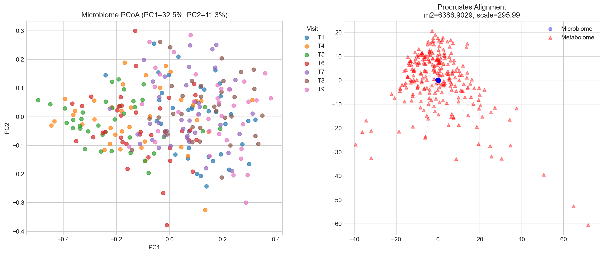
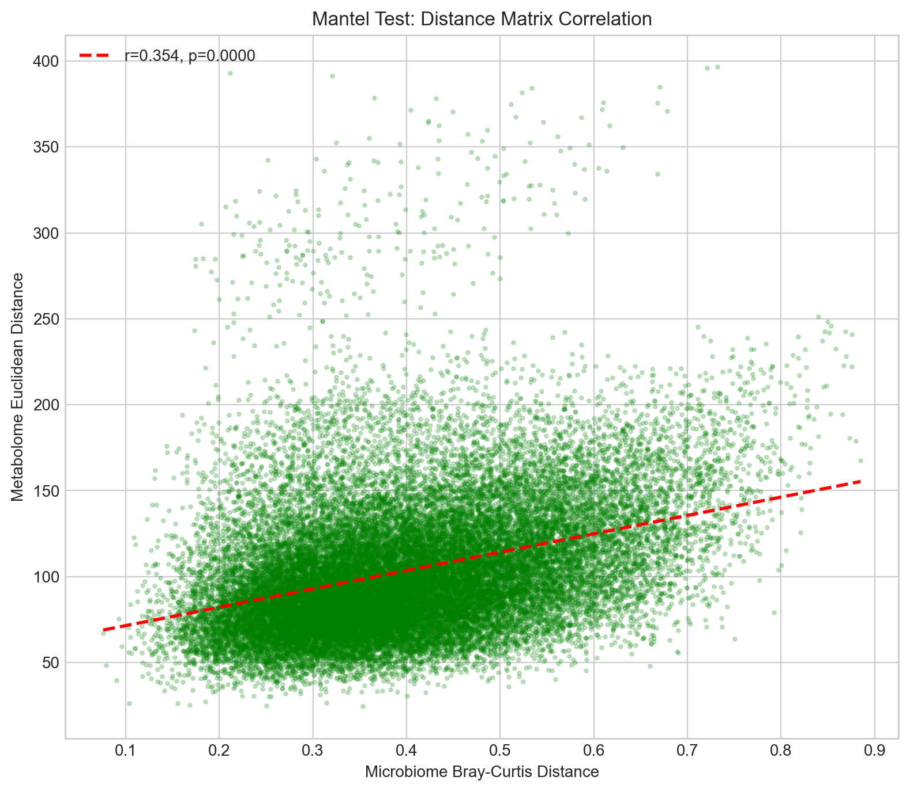
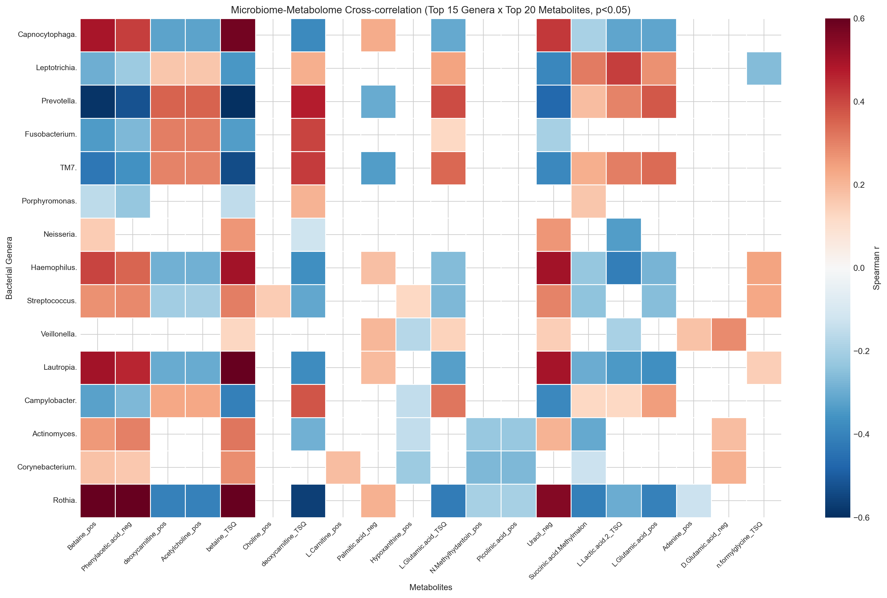
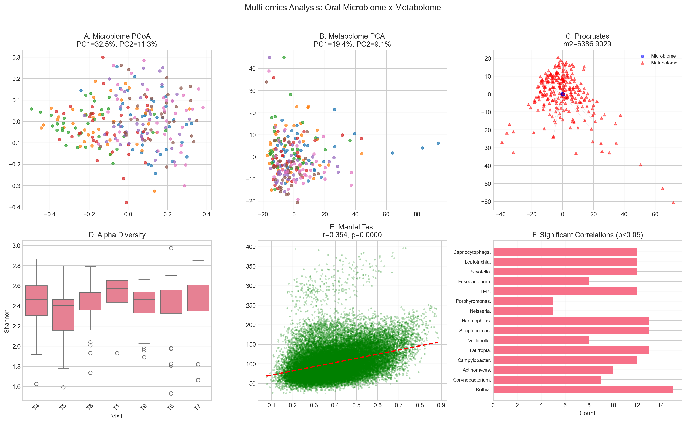

# Multi-omics Analysis Report: Oral Microbiome x Metabolome

**Dataset**: Huang et al. mBio 2021-style paired oral microbiome-metabolome data
**Analysis Date**: 2026-07-17
**Samples**: 261 paired samples (24 participants, 7 timepoints)

---

## 1. Data Overview

| Layer | Features | Samples | Description |
|-------|----------|---------|-------------|
| Microbiome (Genus) | 44 | 261 | 16S rRNA, genus-level |
| Metabolome | 1125 | 261 | LC-MS, untargeted |

**Visit distribution**: {'T1': np.int64(38), 'T4': np.int64(38), 'T5': np.int64(38), 'T6': np.int64(37), 'T7': np.int64(37), 'T8': np.int64(36), 'T9': np.int64(37)}

---

## 2. Cross-omics Joint Analysis Results

### 2.1 Procrustes Analysis

Procrustes analysis tests whether microbiome and metabolome sample configurations are similar after optimal rotation/scaling/translation.

| Metric | Value |
|--------|-------|
| m2 (SSE) | 83019.7571 |
| Normalized m2 | 6386.902913 |
| Scale factor | 295.992 |

> **Interpretation**: Normalized m2 of 6386.9029 indicates poor concordance between microbiome and metabolome configurations.

### 2.2 Mantel Test (Distance Matrix Correlation)

| Metric | Value |
|--------|-------|
| Pearson r | 0.354 |
| p-value | 0.0000 |

> **Interpretation**: r=0.354 (p=0.0000) - significant correlation between microbiome and metabolome distances.

### 2.3 Feature-level Cross-correlations

Spearman correlations between all bacterial genera and metabolites:

| Statistic | Count |
|-----------|-------|
| Total pairs tested | 49500 |
| Significant (p<0.05) | 23930 |
| Positive associations | 13069 |
| Negative associations | 10861 |

#### Top 5 Positive Associations

| Genus | Metabolite | r | p |
|-------|-----------|---|---|
| Mic_Rothia. | Leu.Gly_neg | +0.704 | 0.0000 |
| Mic_Rothia. | betaine_TSQ | +0.704 | 0.0000 |
| Mic_Rothia. | Oxalureate_neg | +0.690 | 0.0000 |
| Spi_Treponema. | methacholine_TSQ | +0.689 | 0.0000 |
| Bur_Lautropia. | X.2.3.dihydroxybenzoate_neg. | +0.686 | 0.0000 |

#### Top 5 Negative Associations

| Genus | Metabolite | r | p |
|-------|-----------|---|---|
| Pep_Filifactor. | X5..methylthioadenosine_neg | -0.694 | 0.0000 |
| Pre_Prevotella. | betaine_TSQ | -0.675 | 0.0000 |
| Syn_Synergistes. | X5..methylthioadenosine_neg | -0.672 | 0.0000 |
| Mic_Rothia. | X3.Methylphenylacetic.acid_neg | -0.671 | 0.0000 |
| Mic_Rothia. | X4.Coumaryl.alcohol_neg | -0.666 | 0.0000 |

---

## 3. Figures

### Figure 1: Procrustes Analysis

### Figure 2: Mantel Test

### Figure 3: Cross-omics Correlation Heatmap

### Figure 4: Multi-omics Summary Panel

---

## 4. Methods

- **Procrustes**: Orthogonal Procrustes with optimal rotation/scaling
- **Mantel**: Pearson correlation between Bray-Curtis (microbiome) and Euclidean (metabolome) distance matrices
- **Cross-correlations**: Spearman rank correlation between genera and metabolites

## 5. Conclusions

1. **Procrustes**: m2=6386.9029 indicates weak structural similarity between microbiome and metabolome.
2. **Mantel**: r=0.354 (p=0.0000) shows significant microbiome-metabolome distance correlation.
3. **Feature-level**: 23930 significant genus-metabolite correlations identified (p<0.05).

*Generated by Meta2bAnalyst v0.1.0*